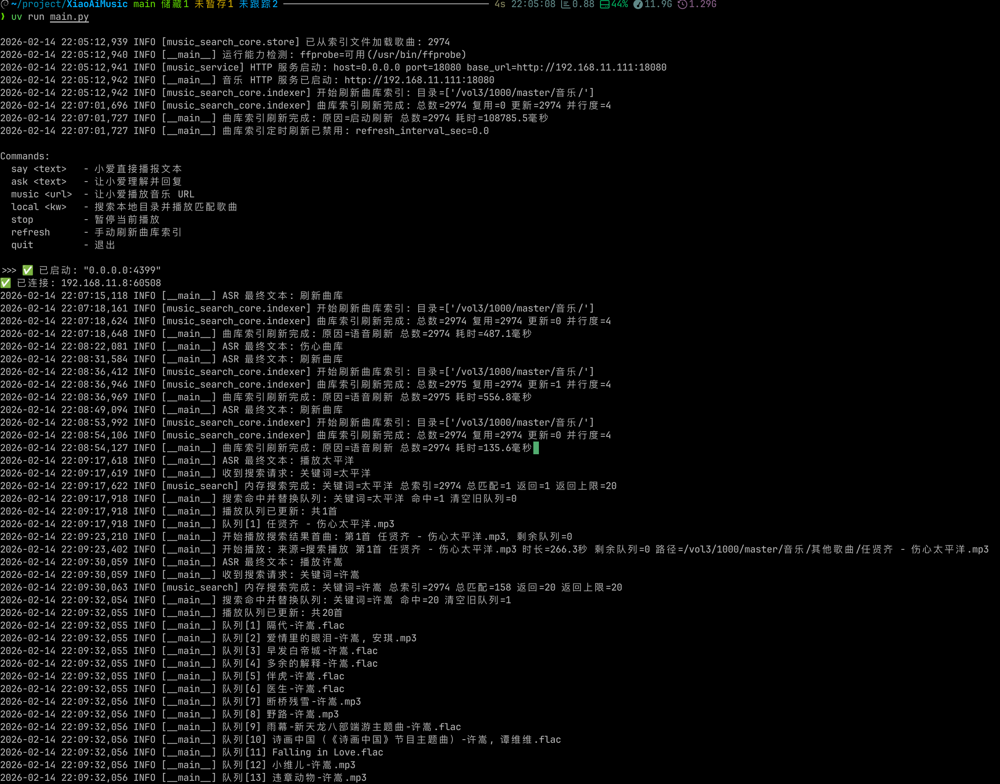

# XiaoAi Music

小爱音箱免费播放本地歌曲，免登录小米账号。

## 致谢

感谢 [idootop/open-xiaoai](https://github.com/idootop/open-xiaoai) 项目。

## 功能


- 曲库索引
  - 启动时自动为曲库建立索引
  - 支持配置定时刷新索引（默认不定时刷新）
  - 支持通过语音命令主动触发刷洗（命令关键词支持配置）
- 通过播放关键词搜索播放歌曲
  - 搜索关键词匹配的歌曲，打乱顺序，提取前20首播放
- 通过停止关键词停止当前播放
- 通过随便听听关键词，随机播放20首歌曲

> 关键词、歌曲数目等均可在config.py中配置

示例：
- 小爱同学，播放许嵩
    - 逻辑：搜索歌名、歌手、专辑名、文件名中包含许嵩的歌曲，打乱顺序，提取前20首播放。
- 小爱同学，停止播放
    - 逻辑：停止当前播放
- 小爱同学，随便听听
    - 逻辑：从曲库中随机播放20首歌曲。

## 安装 ffprobe（必需）

项目使用 `ffprobe` 读取音乐元数据（歌名/歌手/专辑）和精确时长。

- macOS（Homebrew）：

```bash
brew install ffmpeg
```

- Ubuntu / Debian：

```bash
sudo apt update
sudo apt install -y ffmpeg
```

验证：

```bash
ffprobe -version
```

如果未安装 `ffprobe`，程序会在启动时直接报错退出。

## 运行

1. 使用本项目前，请先根据 [idootop/open-xiaoai](https://github.com/idootop/open-xiaoai) 完成小爱音箱刷机并安装 client。

2. 确保小爱端 client 已运行并连接到本机 `4399` 端口。

3. 运行前请先编辑 `config.py`：

- 必选 `music_dirs`：配置多个本地音乐目录
- 可选 `search.max_results`：播放队列取前 N 首
- 可选 `search.refresh_interval_sec`：曲库索引刷新间隔（秒）
- 可选 `search.index_file`：索引文件保存路径（保存歌曲元信息）
- 可选 `commands.play_keywords` / `commands.stop_keywords`：语音命令关键词
- 可选 `http.base_url`：小爱可访问到的服务地址（例如 `http://192.168.11.18:18080`，可选）

4. 执行命令启动服务

```bash
uv run main.py
```

## PM2 后台运行（推荐）

1. 安装 PM2（如未安装）：

```bash
npm i -g pm2
```

2. 启动：

```bash
mkdir -p logs
pm2 start ecosystem.config.cjs
```

3. 查看状态和日志：

```bash
pm2 status
pm2 logs XiaoAiMusic
```

4. 重启 / 停止：

```bash
pm2 restart XiaoAiMusic
pm2 stop XiaoAiMusic
```

5. 开机自启（可选）：

```bash
pm2 save
pm2 startup
```

## nohup 后台运行（免安装）

后台运行：

```bash
mkdir -p logs
nohup uv run main.py > logs/app.log 2>&1 &
echo $! > logs/app.pid
```

监听日志：

```bash
tail -f logs/app.log
```

停止进程（按 PID）：

```bash
kill "$(cat logs/app.pid)"
```

重启（先停再起）：

```bash
kill "$(cat logs/app.pid)" 2>/dev/null || true
nohup uv run main.py > logs/app.log 2>&1 &
echo $! > logs/app.pid
```
